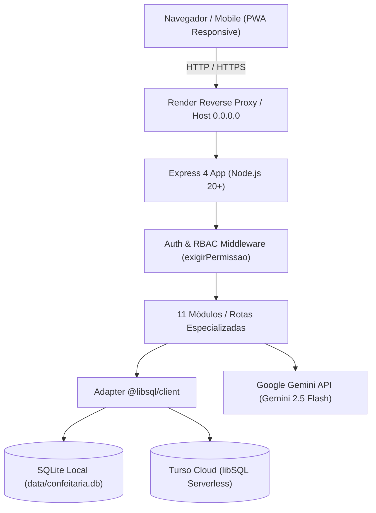

# 🧁 DocePreço — Documentação Técnica & Operacional Completa

> **Versão do Sistema**: 1.0.0 (Onda 5 + Master RBAC + Onboarding Completo)  
> **Arquitetura**: Node.js • Express • EJS • libSQL (SQLite / Turso) • Gemini AI • Docker/Render  
> **Status de Qualidade**: 16 Suítes de Testes Automatizados (100% de Aprovação)

---

## 📑 Índice
1. [Visão Geral & Proposta de Valor](#1-visão-geral--proposta-de-valor)
2. [Arquitetura & Stack Tecnológica](#2-arquitetura--stack-tecnológica)
3. [Módulos do Sistema](#3-módulos-do-sistema)
   - [3.1 Custos Fixos & Mão de Obra](#31-custos-fixos--mão-de-obra)
   - [3.2 Insumos, Embalagens & Estoque com Validade](#32-insumos-embalagens--estoque-com-validade)
   - [3.3 Fichas Técnicas & Precificação Inteligente](#33-fichas-técnicas--precificação-inteligente)
   - [3.4 Comercial: Clientes & Integração WhatsApp](#34-comercial-clientes--integração-whatsapp)
   - [3.5 Pedidos, Orçamentos & Propostas Visuais](#35-pedidos-orçamentos--propostas-visuais)
   - [3.6 Agenda de Entregas & Calendário Operacional](#36-agenda-de-entregas--calendário-operacional)
   - [3.7 Planejamento & Compras Inteligente](#37-planejamento--compras-inteligente)
   - [3.8 Modo Cozinha & Ordens de Produção](#38-modo-cozinha--ordens-de-produção)
   - [3.9 DoceIA: Assistente Virtual com Aprendizado Contínuo](#39-doceia-assistente-virtual-com-aprendizado-contínuo)
   - [3.10 Usuário Master & Controle Granular de Permissões (RBAC)](#310-usuário-master--controle-granular-de-permissões-rbac)
   - [3.11 Sistema de Onboarding & Jornada Guiada de Primeiros Passos](#311-sistema-de-onboarding--jornada-guiada-de-primeiros-passos)
4. [Banco de Dados & Migrações Versionadas (001 a 013)](#4-banco-de-dados--migrações-versionadas-001-a-013)
5. [Segurança & Multi-Tenancy](#5-segurança--multi-tenancy)
6. [Suíte de Testes Automatizados (16 Suítes)](#6-suíte-de-testes-automatizados-16-suítes)
7. [Guia de Implantação e Configuração (Render & Local)](#7-guia-de-implantação-e-configuração-render--local)

---

## 1. Visão Geral & Proposta de Valor

O **DocePreço** é uma plataforma completa e especializada para confeiteiros, ateliês de doces e fábricas de bolos. O sistema resolve as maiores dores do segmento:
- **Fim do Prejuízo Invisível**: Cálculo matemático exato da hora trabalhada (`cfHora`) somado aos insumos reais e perdas operacionais.
- **Precificação Automática com Lucro Real**: Sugestão imediata de preço por unidade, fatia ou cento, com base na margem líquida desejada.
- **Agilidade Comercial**: Criação de orçamentos rápidos e geração de mensagens formatadas profissionais para envio no WhatsApp com 1 clique.
- **Gestão de Cozinha**: Modo Cozinha com pesagem guiada, timers sonoros e heurística de sequenciamento de misturas.
- **Inteligência Artificial Nativa**: Assistente culinária com auditoria de estoque em tempo real e memória contínua baseada em feedbacks.
- **Governança Master**: Controle administrativo total, permissões granulares por usuário e gestão de trilhas de onboarding.

---

## 2. Arquitetura & Stack Tecnológica



- **Backend**: Node.js com Express e arquitetura modular de rotas.
- **Templates**: EJS com componentes reaproveitáveis (`partials/`).
- **Banco de Dados**: `@libsql/client` (compatibilidade transparente entre SQLite local em arquivo e banco Turso na nuvem).
- **Segurança**: Senhas criptografadas com `bcryptjs` (salt 10-12), sessões com `express-session`, rate limit com `express-rate-limit` contra força bruta.
- **Testes**: Suíte nativa Node.js (`node:assert`) sem dependências pesadas, ultra rápida e executável com `npm test`.

---

## 3. Módulos do Sistema

### 3.1 Custos Fixos & Mão de Obra
- **Rota**: `/custos`
- **Tabelas**: `configuracoes` (horas_mes), `custos_fixos` (item, valor_mensal)
- **Recursos**:
  - Cadastro de despesas estruturais (gás, luz, água, internet, aluguel, pró-labore, MEI).
  - Determinação da carga horária mensal de trabalho (padrão: 160h).
  - Cálculo automático:
    $$\text{Custo Fixo por Hora} = \frac{\sum \text{Despesas Fixas Mensais}}{\text{Horas Mensais}}$$
  - Rateio proporcional do custo fixo pelo tempo de preparo de cada receita.

### 3.2 Insumos, Embalagens & Estoque com Validade
- **Rota**: `/ingredientes`
- **Tabelas**: `ingredientes_catalogo`, `ingredientes_compras`
- **Recursos**:
  - Catálogo unificado de matérias-primas e embalagens.
  - Registro de compras com quantidade da embalagem, valor pago e marca.
  - Cálculo automático do custo unitário por grama ($g$), mililitro ($ml$) ou unidade ($un$).
  - **Gestão de Validades**: Classificação automática de lotes:
    - 🔴 **Vencidos**: Necessitam descarte ou baixa imediata.
    - 🟠 **Em Risco**: Validade nos próximos 7 dias (com sugestão de receitas para aproveitamento).
    - 🟢 **Em Dia**.
  - **Importação/Exportação Excel**: Download de modelo padronizado (`.xlsx`) e importação em lote com conversão inteligente de unidades.

### 3.3 Fichas Técnicas & Precificação Inteligente
- **Rotas**: `/produtos`, `/produtos/novo`, `/produtos/:id`
- **Tabelas**: `produtos`, `ingredientes`, `complementos`
- **Recursos**:
  - Montagem de receitas com ingredientes vinculados ao catálogo e quantidade utilizada.
  - Cadastro de complementos e embalagens por lote ou unidade.
  - Tempo de preparo no fogo/forno para aplicação da taxa de mão de obra (`cfHora`).
  - Margem de lucro desejada (%) e taxa de maquininha/impostos.
  - **Cálculo da Fábrica**:
    $$\text{Custo Lote} = \sum \text{Insumos} + \sum \text{Embalagens} + (\text{Tempo Horas} \times \text{Custo Fixo Hora})$$
    $$\text{Custo Unitário} = \frac{\text{Custo Lote}}{\text{Rendimento}}$$
    $$\text{Preço Sugerido} = \frac{\text{Custo Unitário}}{1 - \frac{\text{Margem \%} + \text{Taxas \%}}{100}}$$

### 3.4 Comercial: Clientes & Integração WhatsApp
- **Rota**: `/clientes`
- **Tabela**: `clientes`
- **Recursos**:
  - Cadastro completo com Nome, WhatsApp/Telefone, Endereço, Bairro, Cidade e Observações/Preferências.
  - Formatação e higienização automática do número telefônico brasileiro (com DDI e DDD).
  - Histórico de pedidos e total investido pelo cliente.
  - Botão direto para iniciar conversa no WhatsApp sem precisar salvar o contato na agenda do celular.

### 3.5 Pedidos, Orçamentos & Propostas Visuais
- **Rotas**: `/pedidos`, `/pedidos/novo`, `/pedidos/:id`
- **Tabelas**: `pedidos`, `pedido_itens`
- **Recursos**:
  - Criação rápida de orçamentos conectando os produtos precificados.
  - Suporte a unidades flexíveis (unidade, kg, cento, fatia).
  - Extras personalizados aninhados por item (toppers, velas, laços, recheios duplos).
  - Registro de data de entrega, valor do sinal pago e saldo pendente.
  - Fluxo de status operacional: `Orçamento` ➔ `Confirmado` ➔ `Em Produção` ➔ `Entregue` (ou `Cancelado`).
  - **Gerador de Mensagem Profissional para WhatsApp**: Gera texto formatado com resumo de itens, extras, valores, endereço e chave PIX para envio em 1 clique.

### 3.6 Agenda de Entregas & Calendário Operacional
- **Rota**: `/agenda`
- **Recursos**:
  - Visão diária: Pedidos para **Hoje** e **Amanhã** com alertas de horário.
  - Visão semanal: Carga de entregas por dia da semana.
  - Visão de calendário mensal interativo.
  - Apuração em tempo real do total a receber e saldo pendente de hoje.
  - Ação rápida de avanço de status diretamente na agenda.

### 3.7 Planejamento & Compras Inteligente
- **Rota**: `/compras`
- **Recursos**:
  - Algoritmo que lê todas as encomendas confirmadas no período e calcula a quantidade exata de cada insumo necessária para produzir tudo.
  - Modos de cálculo:
    1. *Somente Encomendas*: O que falta comprar para entregar os pedidos.
    2. *Estoque Mínimo*: Reposição para atingir a margem de segurança da cozinha.
    3. *Unificado*: Encomendas pendentes + Reposição de segurança.
  - Exportação da Lista de Supermercado formatada para WhatsApp.
  - Botão de **Baixa Atômica no Estoque**: Abate os ingredientes do estoque ao concluir a compra ou envio para a cozinha.

### 3.8 Modo Cozinha & Ordens de Produção
- **Rotas**: `/producao`, `/producao/:id/preparar`
- **Tabela**: `producoes`
- **Recursos**:
  - Escalonamento proporcional matemático da receita (ex: fazer 2,5 lotes recalcula todos os ingredientes proporcionalmente).
  - **Pesagem Guiada**: Checklist interativo de ingredientes com conferência visual de peso.
  - **Timers Sonoros**: Temporizadores múltiplos para controle de tempo de forno, batedeira e descanso.
  - **Sequenciamento Inteligente de Misturas**: Heurística culinária (ou IA) que organiza o passo a passo na ordem certa (mistura de líquidos no liquidificador, secos peneirados na batedeira e fermento por último).
  - Conclusão do lote com registro de tempo real decorrido e baixa automática no estoque.

### 3.9 DoceIA: Assistente Virtual com Aprendizado Contínuo
- **Rotas**: `/assistente`, `/assistente/historico`, `/assistente/mensagem`
- **Tabelas**: `chat_sessoes`, `chat_mensagens`
- **Recursos**:
  - IA especialista alimentada pelo Manual Oficial do Sistema e contexto em tempo real do confeiteiro (pedidos de hoje, itens com estoque baixo, validades).
  - **Guardrails Culinários**: Foco estrito em confeitaria, precificação e operações do sistema.
  - **Avaliação de Respostas**: Botões de feedback (👍 e 👎) em cada resposta.
  - **Encerramento de Atendimento & Síntese de Aprendizado**: Ao encerrar o atendimento, a IA sintetiza o que foi resolvido e consolida a memória contínua para atendimentos futuros.
  - **Chat Drawer Flutuante**: Botão flutuante moderno no canto inferior direito de todas as telas, condicionado à permissão de acesso.

### 3.10 Usuário Master & Controle Granular de Permissões (RBAC)
- **Rotas**: `/master`, `/master/usuarios`, `/master/configuracoes`
- **Tabelas**: `permissoes_usuario`, `configuracoes_globais`
- **Recursos**:
  - Distinção de perfis: `master` (administrador do sistema) vs `confeiteiro` (usuário regular).
  - O primeiro usuário da base torna-se Master automaticamente.
  - **Matriz Granular de Acessos**: Configuração por usuário para os 9 módulos, controlando independentemente:
    - 👁️ *Ver / Exibir no Menu*
    - ➕ *Criar / Inserir*
    - ✏️ *Editar*
    - 🗑️ *Excluir*
  - Bloqueio imediato de contas suspensas (HTTP 403 / Redirecionamento).
  - Redefinição administrativa de senhas.
  - Configurações globais: Nome do sistema, Modo Manutenção, Chave de API Global do Gemini e Banner de Alerta Global.

### 3.11 Sistema de Onboarding & Jornada Guiada de Primeiros Passos
- **Rotas**: `/onboarding/:modulo/concluir`, `/onboarding/:modulo/reiniciar`, `/master/usuarios/:id/onboarding`
- **Tabela**: `usuario_onboardings`
- **Recursos**:
  - **Detecção Automática de Progresso**: Avalia dados reais do banco (custos > 0, ingredientes > 0, receitas > 0, pedidos > 0) e atualiza a régua de progresso (0% a 100%).
  - **Checklist Interativo**: Card na Página Inicial com status de cada etapa, atalhos diretos e controle de minimizar/expandir.
  - **Modal de Boas-Vindas**: Apresenta a plataforma e convida o confeiteiro a iniciar pelo Passo 1.
  - **Continuidade Contextual**: Banners de próximo passo em cada tela interna (Custos ➔ Insumos ➔ Receitas ➔ Pedidos).
  - **Controle Master de Reativação**: O Master pode abrir a lista de guias de qualquer usuário e **reativar ou reiniciar qualquer onboarding** individualmente ou em lote para orientar confeiteiros com dúvidas.

---

## 4. Banco de Dados & Migrações Versionadas (001 a 013)

O sistema conta com um motor de migrações sequenciais versionadas (`_migracoes`) que garante que o banco de dados evolua continuamente em produção sem perda de dados:

| Migração | Descrição |
| :--- | :--- |
| `001_estrutura_inicial_fabrica.sql` | Estrutura base: `usuarios`, `configuracoes`, `custos_fixos`, `produtos`, `ingredientes`, `complementos`. |
| `002_estoque_catalogo_compras.sql` | Controle de estoque: `ingredientes_catalogo` e histórico `ingredientes_compras`. |
| `003_modulo_comercial_clientes.sql` | Base de clientes com telefone/WhatsApp e endereço. |
| `004_pedidos_e_orcamentos.sql` | Gestão de encomendas: `pedidos` e itens vinculados `pedido_itens`. |
| `005_sessions.sql` | Tabela `sessions` para persistência robusta de sessões HTTP em disco/banco. |
| `006_unidades_produtos_e_extras_pedidos.sql` | Suporte a produtos por peso/fatia e itens extras/toppers personalizados. |
| `007_modulo_producao_cozinha.sql` | Ordens de produção e Modo Cozinha: tabela `producoes`. |
| `008_modo_preparo_produtos.sql` | Armazenamento de instruções e modo de preparo nas fichas técnicas. |
| `009_chat_assistente_mensagens.sql` | Estrutura de mensagens do chat com a DoceIA e avaliação 👍/👎. |
| `010_sessoes_atendimento_aprendizado.sql` | Sessões de atendimento e aprendizado contínuo: `chat_sessoes`. |
| `011_usuario_master_e_permissoes.sql` | RBAC: colunas `perfil` e `status`, tabela `permissoes_usuario` e `configuracoes_globais`. |
| `012_garantir_usuario_master.sql` | Provisionamento seguro do usuário master padrão (`admin@docepreco.com`). |
| `013_sistema_onboarding.sql` | Rastreamento e persistência dos guias de onboarding: `usuario_onboardings`. |

---

## 5. Segurança & Multi-Tenancy

- **Isolamento Estrito de Dados**: Todas as consultas de produtos, clientes, receitas, compras, custos e pedidos contêm a cláusula mandatória `WHERE usuario_id = ?`. Um confeiteiro jamais visualiza os dados de outro confeiteiro.
- **Middleware `exigirPermissao(modulo, acao)`**: Valida em nível de rota antes da execução de qualquer query se o usuário logado possui a permissão no módulo. Retorna HTTP 403 imediato se não autorizado.
- **Proteção de Força Bruta**: Rate limiting em `/login` (máximo de 5 tentativas a cada 15 minutos por IP).
- **Proteção contra Enumeração de Contas**: Mensagem padronizada *"E-mail ou senha incorretos"* para usuários inexistentes ou senhas erradas.
- **Render Proxy Binding**: Servidor explicitamente vinculado a `0.0.0.0` com `app.set('trust proxy', 1)` quando executado no Render.

---

## 6. Suíte de Testes Automatizados (16 Suítes)

A integridade do código é verificada por 16 suítes completas de testes automatizados executáveis com um único comando:

```bash
npm test
```

### Relação dos Testes:
1. `test/calculo.test.js`: Cálculos de custo/hora, custo unitário, margem e preço sugerido.
2. `test/integration.test.js`: Isolamento multi-tenant entre múltiplos usuários simultâneos no banco.
3. `test/excel.test.js`: Geração de modelo e importador de planilhas `.xlsx`.
4. `test/estoque.test.js`: Saldo de estoque, compras e movimentações.
5. `test/validade.test.js`: Identificação de lotes vencidos, lotes em risco e descarte de insumos.
6. `test/edicao_compras.test.js`: Atualização de preços de compra e recalculo automático.
7. `test/clientes.test.js`: Formatação de WhatsApp, busca textual e isolamento de clientes.
8. `test/pedidos.test.js`: Orçamentos, produtos por peso, extras aninhados e geração de mensagem WhatsApp.
9. `test/agenda.test.js`: Agrupamento diário, saldo de hoje e calendário mensal.
10. `test/compras.test.js`: Planejamento inteligente de compras para encomendas e baixa de estoque.
11. `test/migrations.test.js`: Aplicação idempotente e integridade das 13 migrações libSQL.
12. `test/inicio.test.js`: Apuração de métricas da Página Inicial e painel de precificação.
13. `test/producao.test.js`: Escalonamento de receitas, timers, heurística culinária e modo de preparo.
14. `test/assistente.test.js`: Guardrails da DoceIA, auditoria de estoque, feedbacks e aprendizado contínuo.
15. `test/master.test.js`: Privilégios master, configurações globais, bloqueio de contas e matriz RBAC.
16. `test/onboarding.test.js`: Apuração de progresso dos 4 passos, ciclo de guias e controle de reativação pelo Master.

---

## 7. Guia de Implantação e Configuração (Render & Local)

### 7.1 Execução Local
```bash
# 1. Clonar repositório
git clone https://github.com/ab20261509/docepreco.git
cd docepreco

# 2. Instalar dependências
npm install

# 3. Executar suíte de testes
npm test

# 4. Iniciar servidor
npm start
# Acesse: http://localhost:3000
```

### 7.2 Credenciais Padrão Inicializadas
- **Usuário Master**: `admin@docepreco.com` | Senha: `Admin123@#`
- **Usuário Confeiteiro**: `antonybr@live.com` | Senha: `Admin123@#`

### 7.3 Deploy no Render.com
- **Web Service**: Node.js com `npm install` e `npm start`.
- **Host Binding**: Servidor configurado para escutar em `0.0.0.0` com detecção de porta via `process.env.PORT`.
- **Disco Persistente**: Criar disco montado em `/data` e configurar a variável `DATA_DIR=/data`.
- **Banco Turso (Opcional para Serverless)**:
  - `TURSO_DATABASE_URL`: `libsql://seu-banco.turso.io`
  - `TURSO_AUTH_TOKEN`: `seu-token-turso`
- **Inteligência Artificial (Opcional)**:
  - `GEMINI_API_KEY`: Chave da API do Google Gemini (se configurada, habilita recursos avançados de IA; caso contrário, o sistema opera 100% normalmente em modo heurístico nativo).
